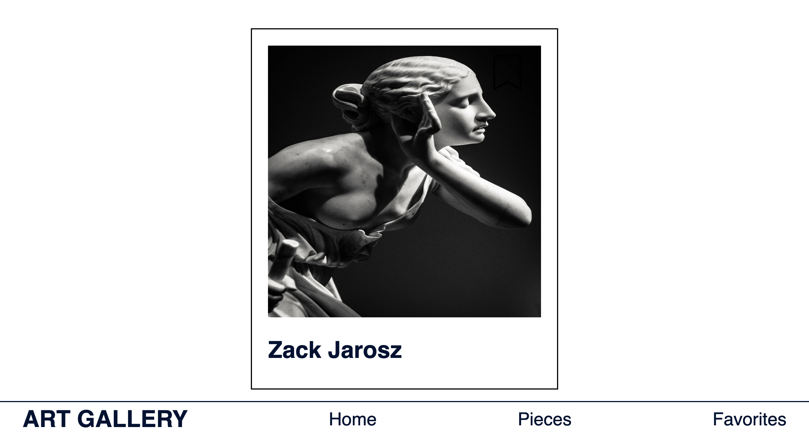
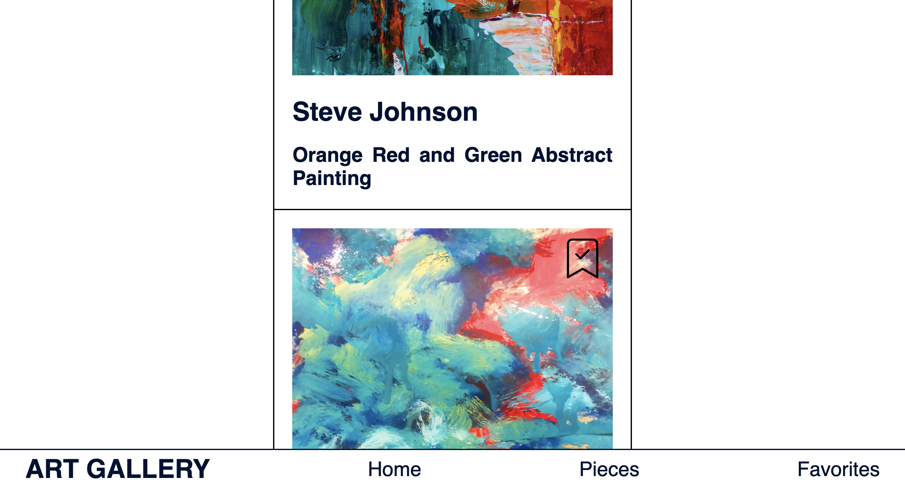

# art-gallery

A simple website for an art gallery to showcase art works. The landing page randomly picks a spotlight piece. Art works can be favored and commented on. Project 5 of the Spiced Web Development bootcamp.

## Local development

To run project commands locally, you need to install the dependencies using `npm i` first.

You can then use the following commands:

- `npm run dev` to start the development server
- `npm run build` to create a production build
- `npm run start` to start the production build

## Technologies

 

## Home

## Gallery

#### Favorite & comment features

